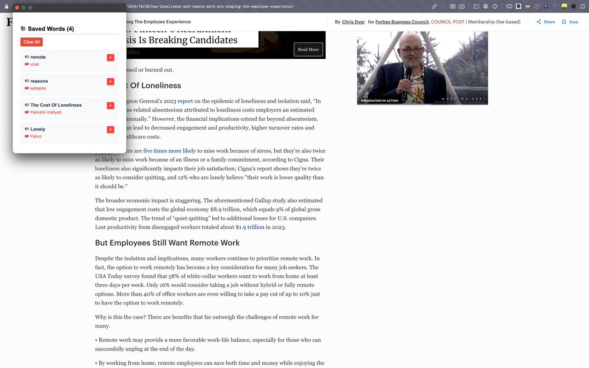

# 📚 Word Saver Extension

A minimal and privacy-friendly Chrome Extension that helps you **save and translate unknown English words** while reading.

Built with **React**, **TypeScript**, **Vite**, and **Bun** — just for fun (and focus) 🎯



---

## 🔍 Features

- ✅ **Right-click** to save any selected English word
- 🌍 **Auto-translate** to Turkish via Google Translate API
- 📋 View your saved words in the extension **popup**
- 🗑️ Delete single words or **clear all** with one click
- 💾 All data stored in **Chrome local storage** — no backend

---

## 🚀 Tech Stack

| Tool            | Description                            |
| --------------- | -------------------------------------- |
| **React + TS**  | Frontend (Popup UI)                    |
| **Vite**        | Lightning-fast dev & build tooling     |
| **Bun**         | Superfast JS runtime + package manager |
| **Chrome APIs** | `contextMenus`, `storage`, `runtime`   |
| **Google API**  | Unofficial translation endpoint        |

---

## 🌍 Bonus: Auto Translate ✨

When you save a word, it's **automatically translated** to Turkish using Google Translate’s unofficial endpoint.

```json
{
  "word": "example",
  "translation": "örnek"
}
```
